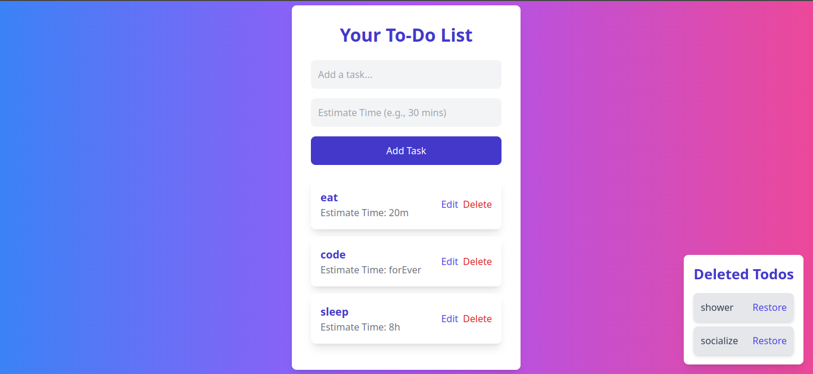

# Simple TodoList
##### this webapp is built in one day the reason for the rush was for learning some concepts.

- #### app image:



#### what i learned:
- manipulating state
- passing props deeply
- manipulating js objects
- mapping data
- sharing state and logic with multiple components
- structuring react project


## usage
```sh
git clone https://github.com/adilma53/Simple-TodoList.git
cd Simple-TodoList
npm install
npm run dev
```
##### then copy local host and run it in browser.

